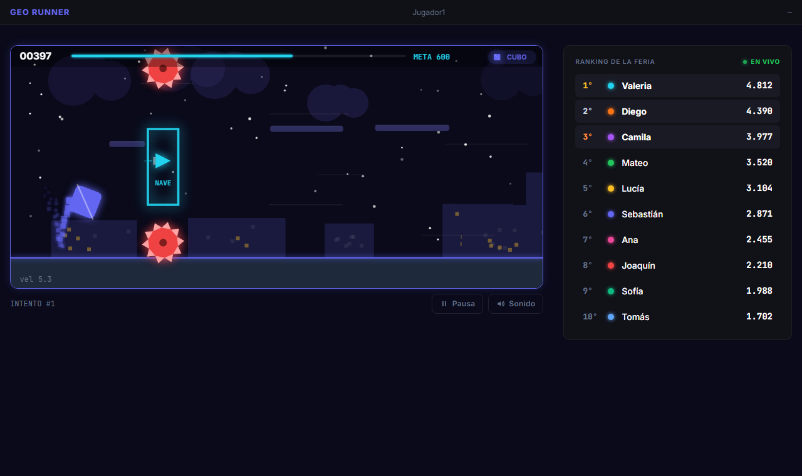
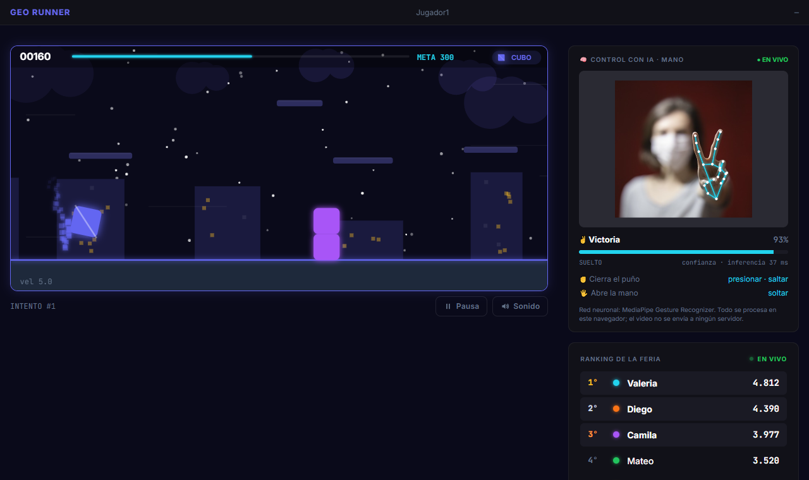
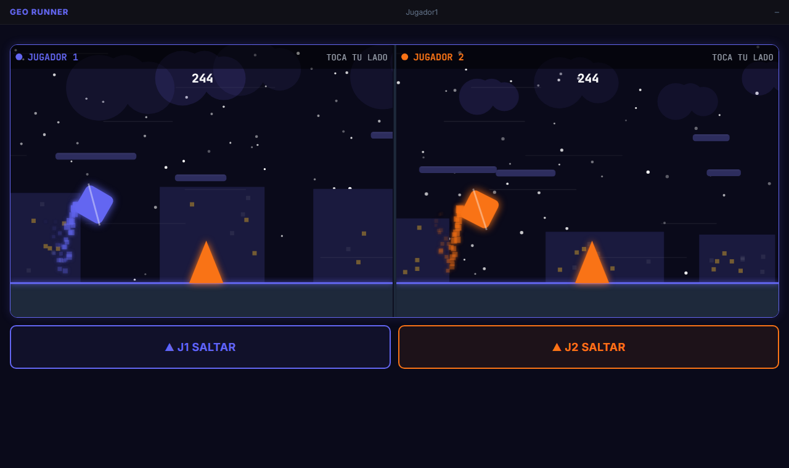
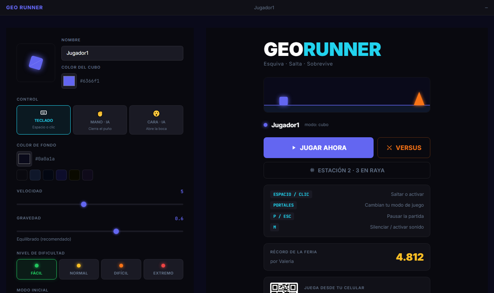
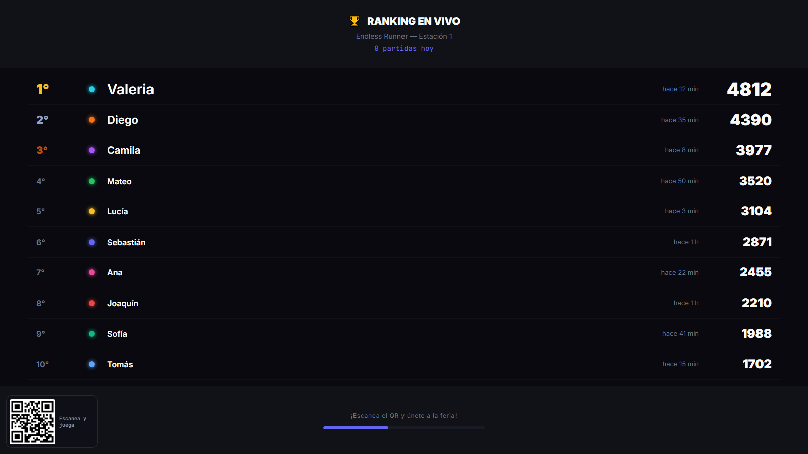
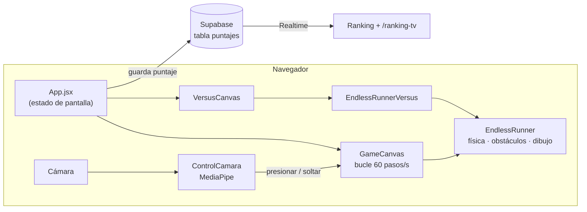

# GeoRunner — Feria de Ingeniería de Sistemas

[](https://github.com/Armand0777/Feria/actions/workflows/ci.yml)
[](https://feria-opal.vercel.app/)

Juego web estilo *Geometry Dash* creado para la feria de Ingeniería de Sistemas. Se puede controlar con el teclado, con un toque o **con la cámara, usando una red neuronal** que reconoce gestos de la mano o de la cara. Los puntajes aparecen al instante en un ranking en vivo pensado para un televisor.



## Características

- **Endless runner** con 6 modos de juego (cubo, nave, bola, OVNI, ola y robot), portales que cambian de modo, 4 niveles de dificultad y más de 20 tipos de obstáculos.
- **Control con IA**: cierra el puño o abre la boca para saltar. Usa redes neuronales de [MediaPipe](https://ai.google.dev/edge/mediapipe) que corren en el navegador; el video nunca sale del equipo.
- **Versus local** para dos jugadores en la misma pantalla (teclado o táctil).
- **Ranking en vivo** con Supabase Realtime y una pantalla para TV en `/ranking-tv`.
- **3 en raya** (Estación 2) contra la máquina o entre dos personas.
- Nítido en cualquier pantalla y con la misma velocidad a 60, 120 o 144 Hz (bucle de paso fijo).

| Control con la mano (IA) | Versus local |
| --- | --- |
|  |  |
| **Inicio y configuración** | **Ranking para TV** |
|  |  |

## Cómo se juega

| Acción | Teclado | Táctil / mouse | Cámara (IA) |
| --- | --- | --- | --- |
| Saltar / subir | `Espacio`, `W` o `↑` | Tocar el juego | ✊ Cerrar el puño · 😮 Abrir la boca |
| Pausa | `P` o `Esc` | Botón **Pausa** | — |
| Sonido | `M` | Botón **Sonido** | — |
| Versus | J1: `W` / `Espacio` · J2: `↑` | Cada uno toca su mitad | — |

## Tecnologías

React 19 · Vite 8 · Tailwind CSS 4 · Canvas 2D · MediaPipe Tasks Vision · Supabase (Postgres + Realtime) · Vercel

## Arquitectura



- `src/games/`: motores en JavaScript puro (sin React). El mundo mide 700×320 unidades lógicas y se dibuja a la resolución real de la pantalla.
- `src/ia/`: control por cámara. Traduce el gesto detectado en las mismas dos señales que el teclado, así que el motor no sabe que lo controla una IA.
- `src/components/`, `src/pages/`: pantallas en React.
- `src/lib/`: audio, cliente de Supabase, bucle de paso fijo y canvas en alta resolución.

Más detalle en [CLAUDE.md](CLAUDE.md).

## Correr en local

```bash
npm install
cp .env.example .env   # y completa tus claves de Supabase
npm run dev
```

Abre http://localhost:5173. La cámara solo funciona con HTTPS o en `localhost`.

Otros comandos: `npm run build` (producción), `npm run lint` (linter).

### Base de datos

En Supabase, una tabla `puntajes` con Realtime activado:

```sql
create table puntajes (
  id uuid primary key default gen_random_uuid(),
  nombre text not null check (char_length(nombre) between 1 and 15),
  color text not null,
  puntaje integer not null check (puntaje >= 0),
  juego text not null default 'geo-runner',
  creado_en timestamptz not null default now()
);

alter table puntajes enable row level security;
create policy "leer puntajes" on puntajes for select using (true);
create policy "guardar puntajes" on puntajes for insert with check (true);

alter publication supabase_realtime add table puntajes;
```

### Modelos de IA sin internet (opcional)

Por defecto los modelos se descargan del CDN de Google la primera vez. Para la feria conviene tenerlos en local: copia `gesture_recognizer.task` y `face_landmarker.task` de [MediaPipe](https://ai.google.dev/edge/mediapipe/solutions/vision/gesture_recognizer) en `public/modelos/`, y el juego los usará automáticamente.

## Despliegue

Vercel publica automáticamente cada push a `main`. `vercel.json` hace que todas las rutas (como `/ranking-tv`) sirvan la app. Configura `VITE_SUPABASE_URL` y `VITE_SUPABASE_ANON_KEY` en las variables de entorno del proyecto en Vercel.

## Autor

Proyecto de [@Armand0777](https://github.com/Armand0777) para la feria de Ingeniería de Sistemas.
